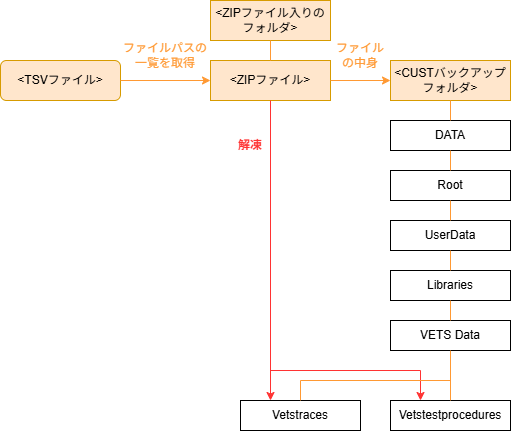
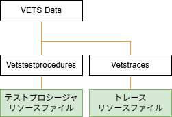
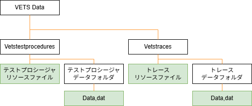
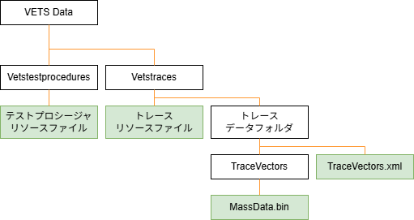
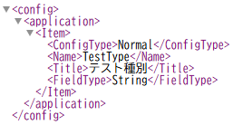
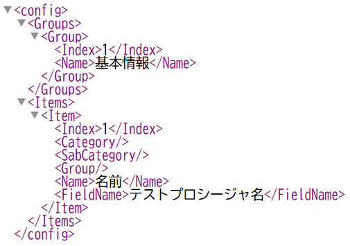

# リソースファイル読み取りツール 仕様書

## 1. 目的
`リソースファイル読み取りツール(ReadTestProcedures)` は、STARS VETSのリソースファイル（XML ファイル、 BIN ファイル、 DAT ファイル）を読み取り、リソース内部の情報を一覧化して TSV 形式で出力するアプリケーションである。

## 2. 対象環境
- 実行形式: コンソールアプリ
- 実行環境: .NET Framework 4.8
- 対応 OS: Windows
- 使用するdll：7z.dll（7z形式のファイルの解凍を行うため）

## 3. 入力
### 3.1 対応入力
- TSV 形式のファイル（TSVファイル）
- ZIP 形式 または 7z 形式のファイルが入っているフォルダ（ZIPファイル入りのフォルダ）
- ZIP 形式 または 7z 形式のファイル（ZIPファイル）
- CUSTバックアップフォルダ

対応入力の紐付きおよび、 CUSTバックアップフォルダ の想定構成、および ZIPファイル の解凍対象フォルダを以下に記載する。

 

[処理対象/解凍対象のフォルダ構成]

### 3.3 リソースファイルの構成
リソースファイル(Vetstestprocedures、Vetstraces)の構成はVETSのバージョンにより変更がなされており、以下の3パターンに分かれる。
- Ver.1.17以前のリソース
- Ver.1.4～Ver.19のリソース
- Ver.2.12以降のリソース

### 3.3.1 Ver.1.17以前のリソース
テストプロシージャ、トレースの各リソースファイルが1つであり、全情報が1つのリソースファイルに入っている。

 

[Ver.1.XX以降のリソース]

### 3.3.2 Ver.1.4～Ver.19のリソース
テストプロシージャ、トレースの各リソースの情報がリソースファイルと Data.dat ファイルに分かれており、2ファイルの情報を総合して確認する必要がある。

 

[Ver.1.4～Ver.19のリソース]

### 3.3.3 Ver.2.12以降のリソース
テストプロシージャのリソースファイルは1つであり、全情報が1つのリソースファイルに入っている。 
トレースのリソースファイルは定義とテーブルデータでそれぞれファイルが分かれており、計3ファイルの情報を総合して確認する必要がある。

 

[Ver.2.XX以降のリソース]

### 3.2 前提
- ZIP ファイル、 7z ファイルが指定された場合は、アプリ内で一時フォルダに展開する処理を行う。
- BIN ファイルは XML の解析結果と紐づくデータとして扱う。

#### 3.3.1 テストプロシージャのリソースファイル（xmlファイル）
テストプロシージャのリソース情報が記載されたxmlファイル 
本ファイルからテストプロシージャの情報を抜き出し確認する。

### 3.3.2 トレースのリソースファイル（xmlファイル）
トレースのリソース情報が記載されたxmlファイル 
トレース時間を取得する際、紐付く TraceVectors ファイルを検索する際に使用する。

### 3.3.3 TraceVectors.xml
トレースのリソース情報が記載されたxmlファイル 
トレース時間を取得する際、紐付く MassData ファイルを検索する際と、 MassData ファイルの情報を取得するための行定義と列情報の確認に使用する。

### 3.3.4 MassData.bin
トレースのリソース情報が記載されたbinファイル 
時間と速度の情報が記載されており、トレース時間を取得する際に使用する。

## 4. 出力

### 4.1 ResultData_All.tsv
- 形式: TSV（タブ区切りテキスト）
- 内容: リソースごとにテストプロシージャ情報を一覧化して表示したファイル 
  ※出力内容の詳細については、 [ファイル](./sample/ResultData_All.tsv) を参照
- 文字コード: SJIS（Excelファイルとして開く想定であるため）
- 出力先フォルダ：{実行フォルダ}\Output
- ファイル名：{元のzipファイル名}_All.tsv
 
※以降、「全体TSV」と記載

### 4.2 ResultData_Selected.tsv
- 形式: TSV（タブ区切りテキスト）
- 内容: 全体TSVに記載された情報から、確認したい情報のみを出力を行ったファイル 
  ※出力内容の詳細については、 [ファイル](./sample/ResultData_Formatted.tsv) を参照
- 文字コード: SJIS（Excelファイルとして開く想定であるため）
- 出力先フォルダ：{実行フォルダ}\Output
- ファイル名：{元のzipファイル名}_Selected.tsv
 
※以降、「整形済TSV」と記載

## 5.設定ファイル
## 5.1 全体TSV整形用設定ファイル（config_all.xml）
- 形式: xml
- 内容: リソース情報から 全体TSV を整形するための設定が記載されたファイル。 
  ※設定内容の詳細については、 [ファイル仕様](1.ファイル仕様.md) を参照
- 文字コード: UTF-8

### 5.1.1 設定項目定義
| No | 項目名 | 型 | 説明 |
|---|---|---|---|
| 1 | MainType | 文字列 | プロパティの種類（※1） |
| 1 | SubType | 文字列 | ドライブユニット設定、イベント設定の種類 |
| 2 | Name | 文字列 | プロパティ名 |
| 3 | Title | 文字列 | 中間ファイルに出力する際のタイトル |
| 4 | FieldType | 型 | 該当プロパティの型 |

※1 MainTypeのプロパティの種類は以下。項目ごとに取得するXML内の階層が自動決定される。
| No | 項目名 | 大項目| 中項目 | 小項目 | 連番 |
|---|---|---|---|---|---|
| 1 | Base | - | - | - | - |
| 2 | Unit | ユニット設定 | - | - | 〇 |
| 3 | Trace | ドライブユニット設定 | トレース | トレース | 〇 |
| 4 | Event | ドライブユニット設定 | イベント | - | 〇 |
| 5 | Action | ドライブユニット設定 | イベント | アクション | 〇 |
| 6 | Soak | ソーク | - | - | 〇 |
| 7 | Custom | カスタムフィールド | - | - | - |

## 5.2 フォーマットTSV整形用設定ファイル（config_selected.xml）
- 形式: xml
- 内容: 全体TSV を整形して 整形済TSV を生成するための設定が記載されたファイル。 
  ※設定内容の詳細については、 [ファイル仕様](1.ファイル仕様.md) を参照
- 文字コード: UTF-8

### 5.1.1 設定項目定義
| No | 項目名 | 型 | 説明 |
|---|---|---|---|
| 1 | Group | - | - |
| 2 | Index | 数値 | 列数（1=1列目、2=2列目...） |
| 3 | Name | 文字列 | 中間ファイルに出力する際のタイトル |
| 4 | Item | - | - |
| 5 | Index | 数値 | 列数（1=1列目、2=2列目...） |
| 6 | Category | 文字列 | 中間ファイルを検索する際の大項目 |
| 7 | SubCategory | 文字列 | 中間ファイルを検索する際の中項目 |
| 8 | Group | 文字列 | 中間ファイルを検索する際の小項目 |
| 9 | Name | 文字列 | 中間ファイルを検索する際の項目名 |
| 10 | FieldName | 文字列 | 出力ファイルに出力する際の列名 |

※Groupの設定がない場合、グループ情報は出力されない

## 6. コマンドライン仕様
## 6.1 書式
`CheckTestProcedures.exe <inputPath> [-o <outputFilePath>] [-f <formatFilePath>]`

## 6.2 引数
- `inputPath`（必須） 
  以下のいずれかのフォルダパス/ファイルパスを指定
  - TSV ファイル
  - ZIPが入っているフォルダ
  - ZIP ファイル
  - CUSTバックアップフォルダ
- `-o <outputFilePath>`（任意） 
  出力ファイルである、 全体TSV および 整形済TSV の「元のzipファイル名」として使用する、フォーマットTSV ファイル名（またはパス）を指定 
  未指定時はZIPファイル名と同一のファイル名で出力
- `-f <formatSettingFilePath>` (任意)  
  フォーマットTSV整形用設定ファイル のファイルパスを指定 
  未指定時はconfigファイルに設定された、規定フォーマット(config_Selected.xml)を使用して出力を実施

## 6.3 使用例
- フォルダ を処理
  - `CheckTestProcedures.exe sample`

- フォルダ を処理し、出力ファイル名を指定
  - `CheckTestProcedures.exe sample -o output.tsv`

- ZIP を処理
  - `CheckTestProcedures.exe sample.zip -o output.tsv`

## 7. 処理フロー
1. コマンドライン引数を解析する。
2. 入力パスの種別を判定する。
 - 対象がTSVファイルの場合、「TSVファイル」として、TSVファイルを読み込む。
   {ZIPファイルパス}\t{ファイル名}の形式で設定されているため、その情報を基に3.以降の処理を実施する。
 - 対象がZIPファイルの場合、「ZIP ファイル」
 - 対象がフォルダ、かつ内部にZIPファイルが存在する場合、「ZIPが入っているフォルダ」
 - 対象がフォルダ、かつ内部に[DATA]フォルダが存在する場合、「CUSTバックアップフォルダ」
 - 上記にすべて当てはまらない場合はエラーとする。
3. 入力がフォルダの場合、内部ファイルを確認する。 
ZIPファイルが存在する場合、4.の処理を実施する。
4. 入力が ZIP(または7z) の場合、作業用一時フォルダに Vetstestprocedures フォルダ、 Vetstraces フォルダのみ（フォルダパスの後方一致検索）を解凍する。
5. 以下の分岐により、テストプロシージャの情報を読み取る。
 - 
6.  ソースTSV整形用設定ファイル の記載内容を基に、抽出結果を ソースTSV に整形して出力する。
7.  フォーマットTSV整形用設定ファイル の記載内容を基に、抽出結果を フォーマットTSV に整形して出力する。
8. 一時フォルダをクリーンアップする（ZIP 処理時）。

## 8. 想定工数
想定工数としては以下を見込んでいる。 
※本仕様書から、GitHub Copilotを使用してある程度は作成させる想定
| No | 種類 | 工数 | 説明 |
|---|---|---|---|
| 1 | フォーマット作成 | 0.5人日 |  |
| 2 | 開発 | 2人日 |  |
| 3 | テスト | - |  |

## 以降、TODO

## 8. エラーハンドリング
- 引数不足 / 不正な引数
  - 使用方法を表示して終了する。
- 入力ファイルが存在しない
  - エラーメッセージを表示して終了する。
- ZIP 解凍失敗
  - エラーメッセージを表示して終了する。
- XML / BIN 読み取り失敗
  - 対象ファイル名を含むエラーメッセージを表示して終了する。
- TSV 出力失敗（権限不足・パス不正等）
  - 出力先情報を含むエラーメッセージを表示して終了する。

## 9. 終了コード
- `0`: 正常終了
- `1`: 入力/引数エラー
- `2`: 解凍エラー
- `3`: 解析エラー
- `4`: 出力エラー

## 10. 実装クラス分割（提案）
- `Program`
  - エントリーポイント。全体制御。
- `CommandLineOptions`
  - 引数解析結果モデル。
- `CommandLineParser`
  - 引数解析ロジック。
- `InputResolver`
  - 入力種別判定（XML / ZIP）と入力ファイル列挙。
- `ZipExtractor`
  - ZIP 解凍と一時フォルダ管理。
- `ResourceReader`
  - XML / BIN からリソース情報抽出。
- `TsvWriter`
  - TSV 生成・出力。

## 11. 未確定事項
- ログ出力方針（標準出力のみ / ログファイル併用）
